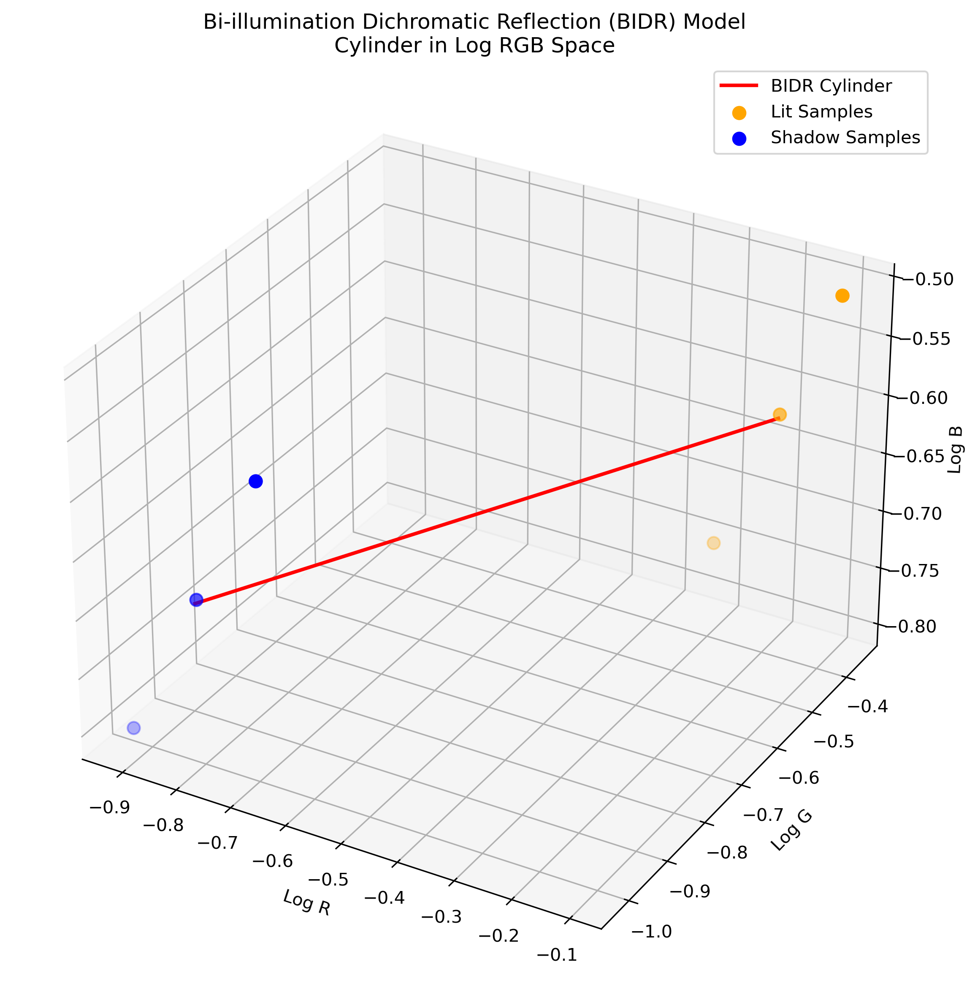
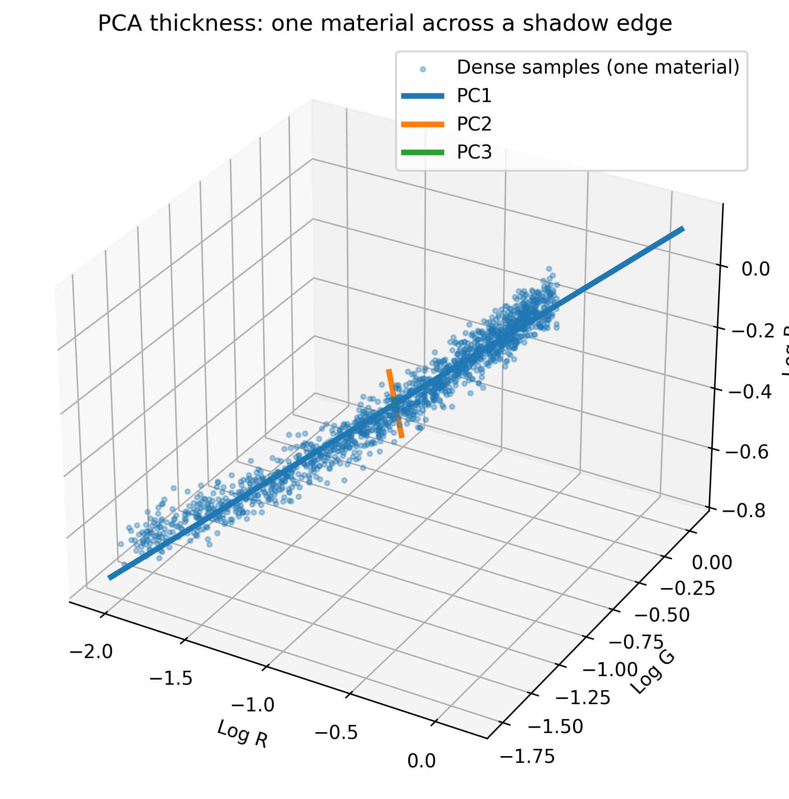
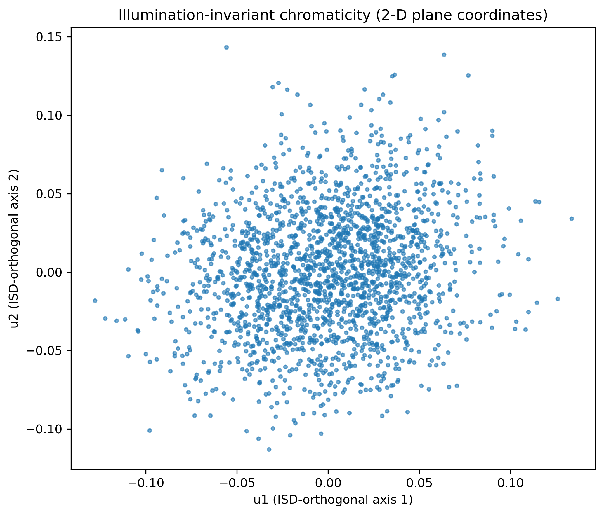
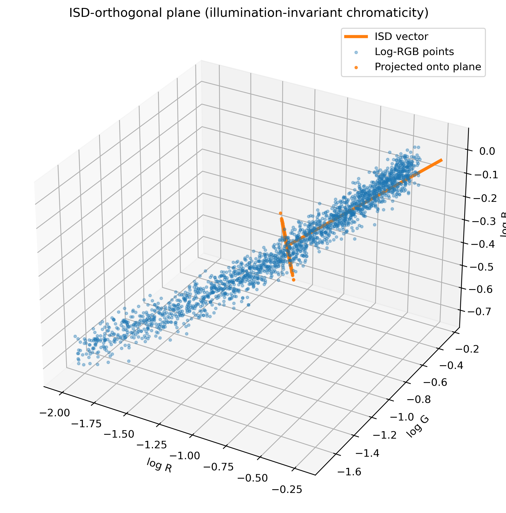
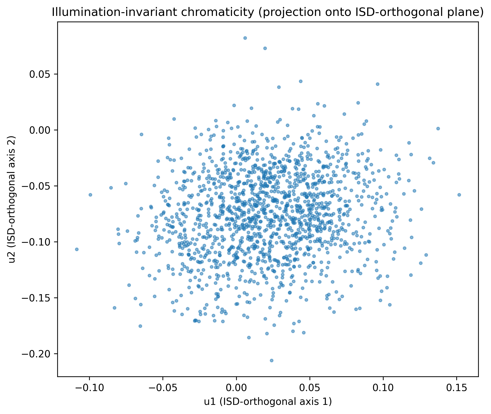
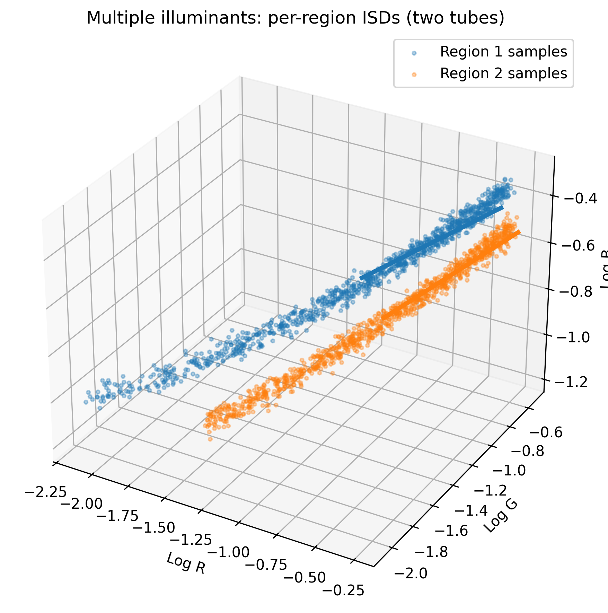

# Bi-illumination Dichromatic Reflection (BIDR) Analysis

This repository explores concepts and implementations from the paper **"A bi-illuminant dichromatic reflection model for understanding images"** by Maxwell et al. (2008). It contains Python implementations for analyzing and visualizing the Bi-illumination Dichromatic Reflection (BIDR) model, a computer vision technique used for understanding how surfaces appear under different lighting conditions.

## Overview

The BIDR model describes how the appearance of surfaces changes when transitioning from direct illumination (lit areas) to ambient illumination (shadows). In the model, observed color **I** is expressed as:

```
I = R_B · (A + γD)
```

Where:

-  **I** is the observed color (RGB triplet)
-  **R_B** is the body reflectance
-  **A** is the ambient illumination
-  **γ** is a scalar for direct illumination intensity
-  **D** is the direct illumination component

## Key Features

### 1. Log-RGB Transformation

In log-RGB space, illumination and reflectance become additive rather than multiplicative, making the analysis more tractable. This transformation reveals the underlying structure of how materials behave under different lighting conditions.

### 2. Illuminant Spectral Direction (ISD)

The ISD represents the direction in log-RGB space along which illumination varies. Materials under the same illumination conditions share the same ISD, making it possible to separate illumination effects from material properties.

### 3. Illumination-Invariant Chromaticity

By projecting onto the plane orthogonal to the ISD, we can obtain illumination-invariant representations of material chromaticity.

## Files Description

### Core Analysis Scripts

-  **`simulate_cylinder.py`** - Basic BIDR cylinder demonstration in log-RGB space
-  **`pca_logchroma_multipleIlluminance.py`** - Comprehensive BIDR analysis including:
   -  PCA analysis of cylinder thickness
   -  Chromaticity plane projections
   -  Multiple illuminant scenarios
-  **`chroma_plane_2d_3d.py`** - 2D and 3D visualization of chromaticity planes
-  **`linear_log_comparison.py`** - Comparative analysis of linear vs log-RGB representations

### Output Directory

-  **`linear_log_outputs/`** - Contains generated figures and processed images from the linear vs log-RGB comparison

## Installation

### Requirements

```bash
pip install numpy matplotlib imageio scikit-learn
```

### Optional Dependencies

-  `scikit-learn` - For PCA analysis (falls back to SVD if unavailable)
-  `imageio` - For image processing in linear_log_comparison.py

## Usage

### Basic BIDR Cylinder Visualization

```bash
python simulate_cylinder.py
```

Generates: `BIDR_cylinder_simulation_log_RGB.png`

<details>
<summary>Preview</summary>



</details>

### Comprehensive BIDR Analysis

```bash
python pca_logchroma_multipleIlluminance.py
```

Generates:

-  `BIDR_cylinder_simulation_log_RGB.png`
-  `pca_cylinder_thickness.png`
-  `chromaticity_plane_projection.png`
-  `multiple_illuminants_tubes.png`

### Chromaticity Plane Visualization

```bash
python chroma_plane_2d_3d.py
```

Generates:

-  `chromaticity_plane_3d.png`
-  `chromaticity_plane_2d.png`

### Linear vs Log-RGB Comparison

```bash
python linear_log_comparison.py
```

Requires: `outdoor_shadow.png` in the same directory
Generates multiple comparison figures in `linear_log_outputs/` directory

## Generated Visualizations

### 1. BIDR Cylinder

Shows how lit and shadow samples of the same material form a cylindrical structure in log-RGB space, with the cylinder axis aligned with the ISD.


### 2. PCA Thickness Analysis

Demonstrates the thickness of the BIDR cylinder using dense sampling across shadow edges, revealing the principal components of variation.



### 3. Chromaticity Plane Projections

Visualizes illumination-invariant material properties by projecting onto planes orthogonal to the ISD.

**2D Projection:**


**3D Visualization:**


**Standard Projection:**


### 4. Multiple Illuminant Analysis

Shows how different illumination conditions create separate BIDR tubes with different ISDs.



### 5. Linear vs Log-RGB Comparison

Demonstrates the advantages of log-RGB representation for shadow analysis:

-  Enhanced contrast in dark regions
-  Compressed highlights
-  More uniform distribution of intensity values

**Visual Comparison:**


**Intensity Profile Analysis:**


**Mapping Curve Comparison:**


**Histogram Analysis:**


## Result Analysis

This section presents a detailed analysis of the linear vs. log-RGB comparison experiments, demonstrating the fundamental advantages of log-RGB representation for illumination-invariant analysis.

### Figure 1: Linear RGB vs Log-RGB Comparison

The side-by-side visual comparison reveals the transformative effect of log-RGB representation:

**Linear RGB (Left)**

-  Grass and clothing appear correctly exposed with natural color balance
-  Shadow regions are nearly black, with significant loss of texture and detail in dark areas
-  Bright sky and reflections exhibit strong intensity differences that dominate the dynamic range
-  The image maintains perceptually natural appearance but loses information in extreme regions

**Log-RGB (Right)**

-  Overall scene appears significantly brighter due to logarithmic compression of high values and expansion of low values
-  Shadow regions under arms and on grass reveal subtle details previously invisible in linear space
-  Highlight regions including bright sea and upper grass areas appear flattened and washed out
-  This highlight compression is advantageous for reflectance modeling as it removes dominance of illumination extremes

**Key Insight**: Log-RGB equalizes the scene luminance range, enhancing visibility in dark regions while reducing contrast between light and shadow areas. This property is essential for illumination-invariant modeling where the goal is to separate material properties from lighting effects.

### Figure 2: Intensity Profile Across Midline

Analysis of intensity variation along a horizontal midline through the image:

**Linear RGB (Orange Curve)**

-  Exhibits wide fluctuations in intensity values
-  Deep intensity dips correspond to shadow regions, particularly under the children's arms
-  Sharp peaks represent sunlit grass and bright skin surfaces
-  High variance indicates strong illumination-dependent intensity changes

**Log-RGB (Blue Curve)**

-  Maintains consistently high values (approximately 0.9 normalized intensity)
-  Dark pixels are raised in brightness while bright pixels are compressed
-  Reduced variation indicates suppression of multiplicative illumination differences
-  The transformation converts multiplicative relationships into additive ones

**Key Insight**: The log transformation successfully suppresses global illumination differences, making reflectance variation including texture and surface color more uniform. This uniform distribution aligns with the core objective of the BIDR model to separate illumination from material properties.

### Figure 3: Mapping Function Comparison

Visualization of the intensity transformation functions:

**Linear Mapping (Blue Line)**

-  Represents a straight diagonal line indicating 1:1 intensity mapping
-  Preserves original intensity relationships without modification
-  Maintains proportional relationship between input and output values

**Logarithmic Mapping (Orange Line)**

-  Rises steeply at low intensities, boosting dark regions and enhancing shadow contrast
-  Flattens near maximum intensity value of 1.0, compressing highlights
-  The steep initial slope provides enhanced contrast in shadow regions
-  The flattened tail prevents saturation in bright regions

**Key Insight**: This function visually explains the observed brightness increase in shadows and flatness in highlights seen in Figure 1. The nonlinear mapping is an inherent property of the logarithmic curve, specifically designed to balance information content across the dynamic range.

### Figure 4: Histogram Distribution Analysis

Comparison of intensity distributions between linear and log-RGB spaces:

**Linear RGB (Orange Histogram)**

-  Displays broad, roughly bimodal distribution
-  Left cluster represents shadow pixels, right cluster represents highlight pixels
-  Indicates high dynamic range with significant populations in both dark and bright regions
-  Distribution reflects the natural intensity variation in the scene

**Log-RGB (Blue Histogram)**

-  Exhibits sharp peak near normalized intensity value of 1.0
-  Pixel values are compressed toward higher normalized intensities
-  Reduced variance with upward shift in mean brightness
-  The transformation balances overall tonal distribution

**Key Insight**: The histogram confirms that dark regions undergo local contrast expansion while the overall intensity range is compressed. This reduces global dynamic range while simultaneously improving feature visibility in low-light areas. The result is a more uniform distribution of pixel intensities that facilitates subsequent analysis of material properties independent of illumination conditions.

### Summary of Benefits

The experimental results demonstrate several critical advantages of log-RGB representation for BIDR analysis:

1. **Enhanced Shadow Detail**: Logarithmic expansion of dark values reveals texture and structure in shadowed regions that would otherwise be lost
2. **Highlight Compression**: Reduction of bright value dominance prevents saturation and balances feature importance across the scene
3. **Uniform Intensity Distribution**: Transformation from multiplicative to additive relationships creates more uniform pixel value distributions
4. **Illumination Invariance**: Suppression of global illumination variations enables focus on material reflectance properties
5. **Improved Model Tractability**: Linear trajectories in log-RGB space simplify the mathematical analysis of material transitions between lit and shadowed regions

These properties collectively justify the use of log-RGB space as the foundation for BIDR model implementation and illumination-invariant image analysis.

## Key Concepts

### Log-RGB Benefits

-  **Additive Model**: Illumination and reflectance become additive
-  **Linear Trajectories**: Material transitions form straight lines
-  **Enhanced Shadows**: Better contrast in dark regions
-  **Compressed Highlights**: Prevents saturation in bright areas

### Applications

-  **Shadow Detection**: Identifying shadowed regions in images
-  **Material Segmentation**: Separating different materials under varying illumination
-  **Illumination Estimation**: Recovering lighting conditions from images
-  **Color Constancy**: Achieving illumination-invariant color representation

## Technical Details

### Mathematical Foundation

The BIDR model assumes that surfaces exhibit dichromatic reflection, where the observed color is a combination of:

1. **Body Reflection**: Light that penetrates the surface and reflects the material's intrinsic color
2. **Interface Reflection**: Direct reflection from the surface interface

### ISD Computation

The Illuminant Spectral Direction is estimated as:

```python
isd = np.mean(lit_log - shadow_log, axis=0)
isd /= np.linalg.norm(isd)
```

### Chromaticity Projection

Illumination-invariant chromaticity is obtained by projecting onto the plane orthogonal to the ISD:

```python
u1, u2 = orthonormal_basis_from_vector(isd)
proj_x = logI @ u1
proj_y = logI @ u2
```

## Author

Carolina Li

## Date

October 26, 2025

## References

This implementation is based on the Bi-illuminant Dichromatic Reflection model:

**Maxwell, B. A., Friedhoff, R. M., & Smith, C. A.** (2008). A bi-illuminant dichromatic reflection model for understanding images. _2008 IEEE Conference on Computer Vision and Pattern Recognition_, Anchorage, AK, USA, 1-8. doi: [10.1109/CVPR.2008.4587491](https://doi.org/10.1109/CVPR.2008.4587491)

Additional references include research in computer vision and color constancy, particularly work on dichromatic reflection models and illumination-invariant image analysis.
